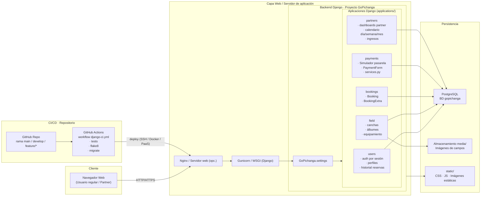

# GO PICHANGA · Documentación del proyecto

Plataforma web para la **reserva de canchas deportivas** y la **gestión de locales** por parte de arrendatarios (partners), construida con **Django + PostgreSQL**.

Este documento describe:

- La visión funcional del sistema.
- La arquitectura y estructura del código.
- Cómo instalar, configurar y ejecutar el proyecto.
- Los flujos principales (reservas, pagos simulados, dashboards de partner).
- El modelo de ramas y CI/CD propuesto.

---

## 1. Visión general

### 1.1. Roles

**Usuario regular**

- Registrarse e iniciar sesión.
- Ver listado de canchas disponibles con filtros por tipo.
- Ver el detalle de una cancha (fotos, descripción, equipamiento).
- Seleccionar fecha, horario y extras (chalecos, balones, etc.).
- Pasar por un **checkout de pago simulado** (tarjeta) y generar la reserva.
- Consultar su **historial de reservas** y ver detalles.

**Partner (arrendatario)**

- Iniciar sesión con rol `PARTNER`.
- Acceder a un panel de control con:
  - **Calendario del día**: reservas por franja horaria.
  - **Calendario semanal**: vista de semana para la cancha.
  - **Resumen mensual**: métricas de uso (días con más reservas, ingresos, etc. – placeholders listos para gráficas).
  - **Ingresos mensuales**: tabla con reservas, extras y totales.
  - **Editar local**: datos generales, dirección, horario, equipamiento y fotos del campo.

---

## 2. Arquitectura

### 2.1. Arquitectura general

## 3. Aplicaciones Django
### 3.1. users

Modelo de usuario propio (roles: REGULAR, PARTNER).
Registro y login usando sesiones (no se usa el auth de Django por defecto).
Utilidad login_required_session para proteger vistas.
Vista de historial de reservas: filtra las bookings del usuario.

### 3.2. field

Modelo Field: cancha, tipo, dirección, descripción, precio por hora, luces.
Modelo Album: imágenes asociadas a la cancha (primary_image).
Modelo Equipment + FieldEquipment: stock y precio por unidad de cada extra.
Listado de canchas con filtros y detalle de cancha.

### 3.3. bookings

Modelo Booking:
user, field, start, end, status, total_amount.

Estados: pending, confirmed, canceled.

Modelo BookingExtra:
booking, field_equipment, quantity, unit_price.
Servicios para validar solapamientos y construir la duración y monto.

### 3.4. payments

Formulario PaymentForm:
Validación Luhn sobre el número de tarjeta.
Validación de fecha de expiración.

Vista checkout_view:
Recibe fecha, horas y extras desde booking.html.
Calcula el total (horas + extras).
Muestra un formulario de tarjeta simulado.
Si el pago es válido: llama a confirm_payment_and_create_booking() y crea la Booking.

### 3.5. partners

Dashboards para partner:
Día, semana, resumen mensual, ingresos mensuales.

Formularios:
FieldEditForm: edición de información del campo.
AlbumUploadForm: subida de nuevas imágenes.

Servicios para:
Generar slots de media hora.
Consultar reservas por rango de fechas.
Calcular métricas agregadas.

## 4. Requisitos e instalación
### 4.1. Requisitos

Python 3.10+
PostgreSQL 13+
pip / virtualenv

### 4.2. Clonado y entorno virtual
git clone https://github.com/tu-usuario/Go-Pichanga.git
cd Go-Pichanga

python -m venv venv
source venv/bin/activate         Linux / macOS
.\venv\Scripts\activate        Windows PowerShell

### 4.3. Instalación de dependencias

pip install -r requirements.txt

### 4.4. Configuración de base de datos

Crear una base de datos PostgreSQL, por ejemplo:
CREATE DATABASE gopichanga;
CREATE USER gopi_user WITH PASSWORD 'tu_password';
GRANT ALL PRIVILEGES ON DATABASE gopichanga TO gopi_user;

En GoPichanga/settings.py (o en un settings_local.py / variables de entorno) configurar:

DATABASES = {
    "default": {
        "ENGINE": "django.db.backends.postgresql_psycopg2",
        "NAME": "gopichanga",
        "USER": "gopi_user",
        "PASSWORD": "tu_password",
        "HOST": "localhost",
        "PORT": "5432",
    }
}

### 4.5. Migraciones y usuario inicial

python manage.py migrate
python manage.py createsuperuser

## 5. Ejecución local

python manage.py runserver
Listado de canchas: http://127.0.0.1:8000/
Detalle de cancha: /booking/detalle-cancha/<id>/
Checkout / pago: /payments/checkout/<field_id>/
Historial usuario: /history/
Panel partner: /partners/day, /partners/week, /partners/month, /partners/income, /partners/edit-field/<id>/

## 6. Flujos principales
### 6.1. Crear reserva con pago simulado

Usuario regular inicia sesión (vista users:login).
Accede al listado de canchas (field:list).
Entra al detalle de una cancha (booking:detail).
Rellena:
Fecha (date)
Hora de inicio (start_time)
Hora de fin (end_time)
Cantidad de extras (quantity_<FieldEquipment.id>)
Envía el formulario → se redirige a payments:checkout con un resumen.
En checkout:
Revisa fecha y horas.
Introduce datos de tarjeta (simulados, pero válidos según Luhn).
Al confirmar:
payments.services.confirm_payment_and_create_booking() crea:
Booking con estado confirmed.
BookingExtra para cada extra seleccionado.
Se calcula el total (total_amount).
Redirección a users:history donde se ve la nueva reserva.

### 6.2. Historial de reservas

Vista users:history_view.
Filtra Booking por user=request.user (basado en session['user_id']).
Muestra lista con:
Nombre de la cancha.
Fecha y rango horario.
Total.
Botones (placeholder) para editar/cancelar reserva futura.

### 6.3. Panel partner

Solo accesible para usuarios con rol PARTNER.

partners:day:
Genera slots de media hora para la fecha actual.
Marca cada slot como LIBRE o Reservado por NOMBRE.

partners:week:
Construye una grilla de días (lun–dom) vs horas.
Marca la ocupación por reservas.

partners:month y partners:income:
Calculan métricas sobre las reservas del mes:
Días con más reservas.
Ingresos totales.
Equipamiento más usado.
Tabla de reservas + extras + totales.

partners:edit_field:
Permite editar:
Datos básicos del campo.
Dirección y horarios.
Equipamiento disponible.
Imágenes del álbum.

